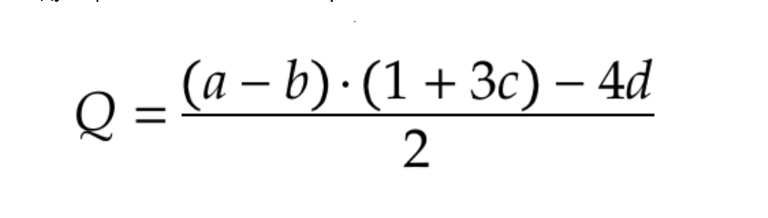

-------------------------------------------
RUS
-------------------------------------------
FPGA ускоритель для формулы :

Оптимизация проходит с учётом возможностей fpga :
ep4ct10t22c8n
Имеющиеся ресурс :

-46 dsp ядер с возможностью конфигурации в 18x18 умножители 
-2 pll 
-10k лутов

Оптимизационные идеи:
1) использовать аппаратное ускорение умножения на основе dsp
2) расчитать нужные ширины операндов для промежуточных вычислений 
3) реализовать схему длинного умножения , если разрядности входных данных большие 
4) Пойти по пути сначала написать реализацию с множеством стадий конвеером , чтобы посмотреть максимальную тактовую частоту и потом обьединять стадии конвеера те , которые можно, чтобы уменьшеить кол-во циклов нужных для прохождения конвеера  
 
Микроархитектура :

Ограничения производные от ресурсов fpga: 
1) Если реализоввать умножение только на dsp, то максимальная ширина операндов - не более 92 бита
